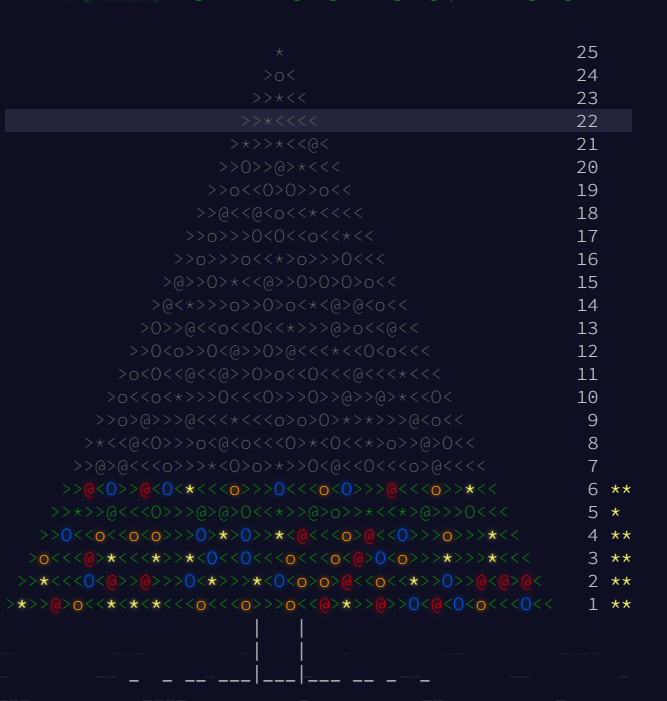

# AventOfCode2015

Advent of Code is an Advent calendar of small programming puzzles for a variety of skill sets and skill levels that can be solved in any programming language you like. People use them as interview prep, company training, university coursework, practice problems, a speed contest, or to challenge each other.

https://adventofcode.com/2015

The exercises will be done in C.

Completed:
- Day 1
- Day 2
- Day 3
- Day 4
- Day 5 - 1st part
- Day 6

